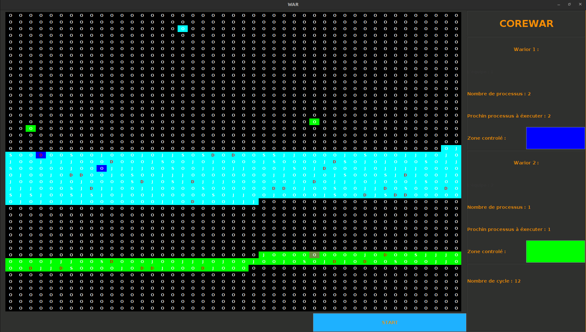

# Corewar Project

## Introduction

As part of my second year of a Bachelor's degree in Computer Science, I developed a project focused on optimizing programs written in Redcode. This project includes a parser, an interpreter written in Java, and an implementation of the simulated annealing algorithm for code optimization. Corewar is a programming game in which programs (written in Redcode) battle in a virtual arena, with the ultimate goal of being the last one running.

## What is Corewar?

Corewar is a programming game where programs called "warriors" compete in a virtual arena. Each warrior attempts to corrupt or destroy its opponents in order to be the last one still executing. The game emphasizes skills in programming, strategy, and optimization.

## What is Redcode?

Redcode is the programming language used in Corewar. It is designed to be simple yet powerful, allowing users to create programs (warriors) that compete in the Corewar arena. Redcode provides basic syntax for memory manipulation, conditional execution, and mathematical operations.

## Optimization with Simulated Annealing

Optimization in this project refers to enhancing Redcode programs to make them more effective in battle. We used the simulated annealing algorithm—a technique that mimics the cooling process of metal—to find an optimal configuration of Redcode instructions that maximizes warrior performance in the arena.

## Features

- **Creation and modification of warriors:** The project allows users to create and modify Redcode programs, giving them the ability to customize combat strategies.
- **Combat simulation:** Users can simulate battles between two warriors to test and refine their creations.
- **Optimized code generation:** Using the simulated annealing algorithm, the project can generate optimized Redcode programs, increasing the chances of success in the arena.

## Visuals

Here are some screenshots of the project and its graphical interface:





## Getting Started

### Prerequisites

#### If running **without Docker**:
Make sure the following are installed on your system:

- **Java JDK 17 or higher**  
- **Git**
- **X11 Display Server** (for Linux users only — needed to launch the GUI)

#### If running **with Docker**:
Make sure you have:

- **[Docker](https://docs.docker.com/get-docker/)**
- **X11 Display Server** (Linux only — GUI support)
- **Git**

---


### ▶️ Run Without Docker

To run the Corewar project directly on your system (no container), use the following commands:

```bash
git clone git@github.com:pentaFreeError/corewar.git
cd corewar/source
chmod +x corewar.sh
./corewar.sh
```

This will compile and launch the application with its graphical interface.

---

## 🐳 Running with Docker (Recommended)

### Step 1: Clone the Repository

```bash
git clone git@github.com:pentaFreeError/corewar.git
cd corewar
```

### Step 2: Build the Docker Image
```bash
xhost +local:docker
docker build -t corewar .
```

### Step 3: Run the Application
```bash
docker run -it --rm \
  -e DISPLAY=$DISPLAY \
  -v /tmp/.X11-unix:/tmp/.X11-unix \
  corewar
```

## License

This project is licensed under the MIT License. For more information, please refer to the [LICENSE](./LICENSE) file.