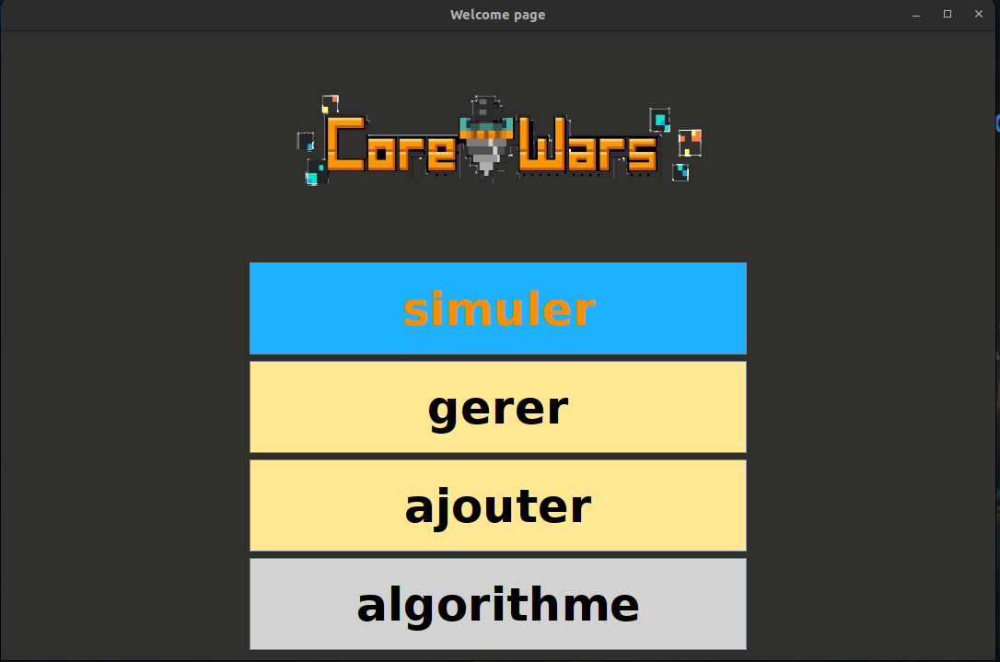
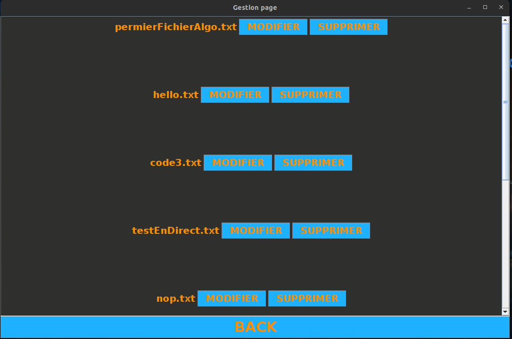
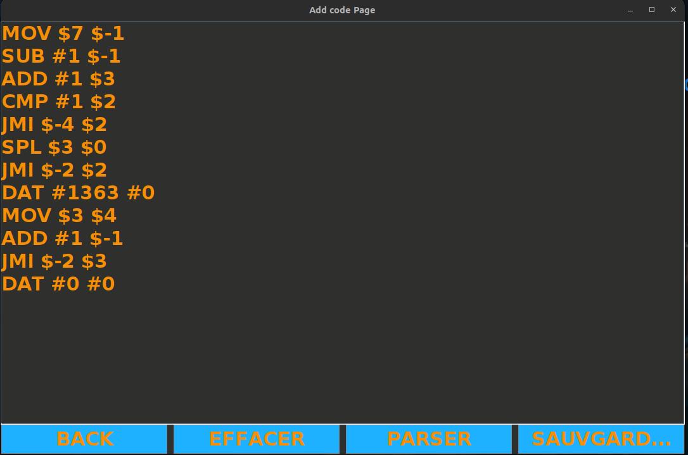

# Projet Corewar

## Introduction

Dans le cadre de ma deuxième année de licence en informatique, j'ai développé un projet axé sur l'optimisation de programmes en Redcode. Ce projet comprend un parseur, un interpréteur écrit en Java, et une implémentation de l'algorithme de recuit simulé pour l'optimisation de code. Corewar est un jeu de programmation dans lequel les programmes (écrits en Redcode) s'affrontent dans une arène virtuelle, avec pour but ultime de rester le dernier en fonctionnement.

## Qu'est-ce que Corewar ?

Corewar est un jeu de programmation où des programmes appelés "warriors" s'affrontent dans une arène virtuelle. Chaque guerrier tente de corrompre ou de détruire ses adversaires pour être le dernier en cours d'exécution. Ce jeu met en évidence des compétences en programmation, en stratégie et en optimisation.

## Qu'est-ce que le Redcode ?

Redcode est le langage de programmation utilisé dans Corewar. Il est conçu pour être simple mais puissant, permettant aux utilisateurs de créer des programmes (warriors) qui s'affrontent dans l'arène de Corewar. Redcode offre une syntaxe de base pour la manipulation de la mémoire, l'exécution de commandes conditionnelles et la réalisation d'opérations mathématiques.

## Optimisation avec l'algorithme de recuit simulé

L'optimisation dans ce projet se réfère à l'amélioration des programmes Redcode pour les rendre plus efficaces en combat. Nous avons utilisé l'algorithme de recuit simulé, une technique d'optimisation qui imite le processus de refroidissement du métal, pour trouver une configuration optimale des instructions Redcode qui maximise les performances des warriors dans l'arène.

## Mise en route

Pour lancer le projet Corewar, exécutez le fichier `corewar.sh`. Ce script se charge de compiler et d'exécuter le main, vous permettant d'interagir avec le programme.

### Fonctionnalités

- **Création et modification de warriors :** Le projet permet de créer et de modifier des programmes en Redcode, offrant aux utilisateurs la possibilité de personnaliser leurs stratégies de combat.
- **Simulation de combat :** Les utilisateurs peuvent simuler des combats entre deux warriors pour tester et affiner leurs créations.
- **Génération de code optimisé :** Grâce à l'algorithme de recuit simulé, le projet est capable de générer des programmes Redcode optimisés, augmentant ainsi les chances de succès dans l'arène.

## Visuals

Pour donner un aperçu du projet et de son interface, voici quelques captures d'écran et images illustratives :

## Conclusion

Ce projet représente une application pratique de concepts avancés en programmation et en optimisation, dans le cadre ludique et compétitif de Corewar. Il démontre l'efficacité de l'algorithme de recuit simulé pour l'optimisation de code dans un environnement contraint et hautement compétitif.

## Licence

Ce projet est mis à disposition sous la Licence MIT. Pour plus d'informations, veuillez consulter le fichier LICENSE inclus.
